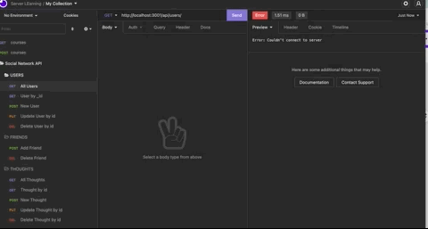

# Social Network API
## Lauren Darrimon
    
    
### Description
Back-end API for a social network web application where users can share their thoughts, react to friends’ thoughts, and create a friend list. Uses Express.js for routing, a MongoDB database, and Mongoose ODM.

### Table of Contents

* [Installation](#installation)
* [Usage](#usage)
* [Contributing](#contributing)
* [Questions](#questions)
* [License](#license)

### [LINK to Video Walkthrough](https://drive.google.com/file/d/1xjWUwbRy7Ns8pSK8XNd67bny_AQxaITt/view?usp=sharing)

### Installation
🔧
In order for this application to work, you need to install the following (dependencies): 
Node.js, Expressjs, MongoDB, and Mongoose. 

~~~
npm i 
~~~

### Usage 
To run the application from the command line: 

~~~
npm start
~~~

### Features 

What can we do with this API? Facilitate CRUD operations and interactions with users, friends, thoughts and reactions. 

USERS: Create, read all, read by id, update, and delete

FRIENDS: Add and delete friends from specific users. Count friends as a virtual property on User schema. 

THOUGHTS: Create, read all, read by id, update, and delete thoughts. Use getter function to format thought time. 

REACTIONS: Create and delete reactions as subdocument of thoughts. Count reactions as virtual property on thought schema. Use getter function for format time of reaction.  

### Contributing 
✍️ 
Lauren Darrimon is the author of this application. Find additional work on Lauren Darrimon's [Github profile.](http://github.com/laurenDarrimon).

### Questions
❓💌
Reach out to Lauren Darrimon at hello@laurenlalita.com if you have any questions. 

### License
The license for this project is: [MIT](https://opensource.org/licenses/MIT)
